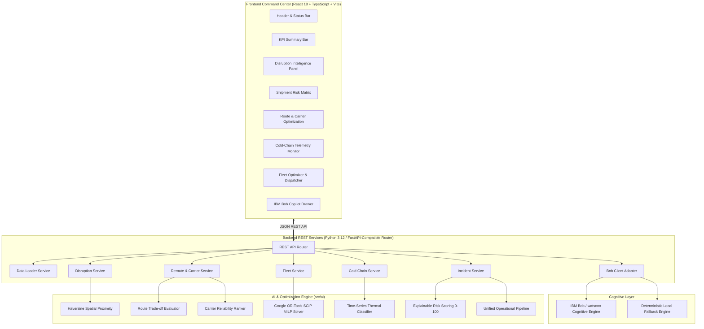

# CHAIN GUARD AI 🛡️📡
### AI-Powered Supply Chain Risk Intelligence & Fleet Optimization

> **IBM Bob AI Innovation Hackathon 2026**  
> **Problem Statement:** L2 Supply Chain Disruption Assistant & Fleet Utilisation Optimizer  
> **Repository:** `https://github.com/mahipatel1126/bob-ai-hackathon-Axiom`  
> **Branch:** `feature/ai-optimization`  

---

## 1. Value Proposition

**Chain Guard AI** is an enterprise-grade logistics control tower that continuously analyzes shipments, corridor disruptions, alternative transit routes, carrier capacity, fleet utilization, and IoT cold-chain telemetry. It leverages **Google OR-Tools Mathematical Optimization (MILP)** and a genuine, load-bearing **IBM Bob Operations Copilot** to provide transparent, explainable operational recommendations and execute autonomous rescue dispatches in real-time.

---

## 2. Core Business Problem

Modern supply chains face frequent, cascading disruptions from severe meteorological events, port strikes, infrastructural accidents, and regulatory compliance breaches. Meanwhile, commercial freight fleets suffer from persistent sub-optimization, with 25–40% of regional assets remaining idle.

When disruptions occur:
1. Operations teams discover corridor bottlenecks too late, causing severe delivery delays and demurrage penalties.
2. In high-stakes cold-chain logistics (biologics, oncology drugs, vaccines), thermal excursions destroy critical inventory if replacement reefer trucks are not dispatched immediately.
3. Dispatchers lack a unified decision platform that balances safety, transit time, cost delta, carrier reliability, and equipment compatibility.

---

## 3. The Solution

**Chain Guard AI** resolves these challenges through an end-to-end operational platform providing:

- **Geospatial Disruption Matching:** Great-circle Haversine spatial proximity analysis matching active disruptions with shipment routes, traversed points, and upcoming waypoints.
- **Explainable Multi-Factor Risk Scoring (0–100 Index):** Transparent factor breakdowns evaluating disruption severity, corridor exposure, deadline pressure, cargo priority, and cold-chain sensitivity.
- **Dynamic Route & Carrier Optimization:** Multi-objective algorithmic evaluation ranking bypass corridors and carriers by risk minimization, delay savings, and cost trade-offs.
- **OR-Tools Mixed-Integer Linear Programming (MILP):** Mathematical optimization for fleet redeployment guaranteeing strict cargo and thermal compatibility while minimizing deadhead relocation costs.
- **IoT Cold-Chain Telemetry & Regulatory Severity Classification:** Time-series sensor processing classifying thermal excursions into `NORMAL`, `WARNING`, `MAJOR`, and `CRITICAL` under **FDA 21 CFR Part 211** and **WHO Good Distribution Practice (GDP)** standards.
- **IBM Bob Operations Copilot:** A load-bearing AI copilot delivering conversational tactical briefings, root-cause explanations, and one-click dispatch execution triggers.

---

## 4. Key Capabilities & Technical Architecture



---

## 5. Role of IBM Bob in Chain Guard AI

IBM Bob is a **genuine, load-bearing operations copilot**, not a cosmetic chatbot:

1. **Context-Aware Reasoning:** Ingests live operational state (active hazards, thermal breaches, idle fleet assets, route alternatives) from the backend.
2. **Tactical Operational Q&A:** Answers mission-critical operator questions:
   - *"Why is SHP-1002 / SHP-1001 critical?"*
   - *"Which idle reefer should we redeploy?"*
   - *"What should operations do about the critical cold-chain excursion?"*
   - *"Which shipment should be rerouted first?"*
3. **Structured Decision Cards:** Returns structured action directives containing priority level, root cause, recommended action, projected impact, and execution triggers.
4. **Resilient Dual-Mode Design:** Connects to live IBM watsonx / Bob API endpoints when credentials are configured (`BOB_API_KEY`), and gracefully degrades to local deterministic AI reasoning when offline—with explicit status labeling.

---

## 6. Optimization & AI Components

| Component | Implementation File | Method / Algorithm | Primary Objective |
| :--- | :--- | :--- | :--- |
| **Spatial Matching** | `src/ai/disruption.py` | Great-Circle Haversine Distance | Detects corridor waypoint intersection with hazard epicenter |
| **Risk Scoring** | `src/ai/risk_scoring.py` | 5-Factor Weighted Linear Index (0–100) | Explains risk via severity, exposure, deadline, cargo, and thermal factors |
| **Route Optimization** | `src/ai/routing.py` | Multi-Objective Penalty Function | Minimizes risk penalty (50%), transit time (30%), and cost (20%) |
| **Carrier Selection** | `src/ai/carrier.py` | SLA & Capacity Multi-Criteria Scoring | Selects verified carriers based on reliability % and equipment compatibility |
| **Fleet Redeployment** | `src/ai/optimization.py` | Google OR-Tools SCIP MILP Solver | Optimal asset assignment minimizing deadhead km under strict reefer constraints |
| **Cold-Chain Analysis** | `src/ai/cold_chain.py` | Time-Series Contiguous Excursion Analysis | Classifies severity under FDA 21 CFR 211 / WHO GDP compliance rules |
| **Pipeline Synthesis** | `src/ai/recommendations.py` | End-to-End Decision Integrator | Produces unified operational incident response packages |

---

## 7. End-to-End Demonstration Story

The platform demonstrates a continuous 6-step incident resolution narrative:

1. **Step 1 — Baseline Operations:** Normal supply chain monitoring across all transit corridors.
2. **Step 2 — Disruption Outbreak:** Severe weather / flood / strike closes Western freight corridor.
3. **Step 3 — At-Risk Isolation:** Critical shipment identified; multi-factor risk score escalates with factor breakdown.
4. **Step 4 — Route Divert:** System calculates bypass route, eliminating 19.0 hours of transit delay.
5. **Step 5 — Fleet Redeployment:** Nearby idle reefer matched via OR-Tools and dispatched (+30.9% utilization gain).
6. **Step 6 — Copilot Decision:** IBM Bob synthesizes incident dossier and presents executive action directives.

---

## 8. Technology Stack

- **Frontend:** React 18, TypeScript, Vite, TailwindCSS, Lucide Icons
- **Backend:** Python 3.12, Standard Library HTTP Server / FastAPI compatible router, Pydantic v2
- **AI & Optimization:** Google OR-Tools (SCIP Mixed-Integer Linear Programming), Haversine Mathematics
- **Cognitive Integration:** IBM Bob / watsonx Cognitive API Adapter
- **Testing & Tooling:** Pytest, TypeScript Compiler (`tsc`), PostCSS

---

## 9. Project Structure

```
bob-ai-hackathon-Axiom/
├── submission.yaml               # Official hackathon submission metadata
├── README.md                     # Comprehensive project documentation
├── CONTRIBUTING.md               # Contribution and branch workflow guidelines
├── .gitignore                    # Git exclusion rules
├── src/
│   ├── ai/                       # P2: AI, Risk Scoring & OR-Tools Optimization Engine
│   │   ├── carrier.py            # Carrier evaluation & ranking
│   │   ├── cold_chain.py         # IoT temperature & FDA/WHO severity classification
│   │   ├── config.py             # Optimization weights & parameters
│   │   ├── demo_data.py          # Deterministic 8-scenario benchmark dataset
│   │   ├── disruption.py         # Geospatial hazard & corridor impact engine
│   │   ├── fleet.py              # Fleet asset classification & reefer filtering
│   │   ├── models.py / schemas.py# Pydantic domain models & schemas
│   │   ├── optimization.py       # Google OR-Tools MILP SCIP optimizer
│   │   ├── recommendations.py    # Unified operational decision pipeline
│   │   ├── risk_scoring.py       # Explainable 0-100 multi-factor risk engine
│   │   ├── routing.py            # Route trade-off & rerouting engine
│   │   ├── run_demo.py           # 8-scenario CLI verification demo
│   │   └── tests/                # AI unit test suite (29 tests)
│   ├── backend/                  # P1: REST API & Backend Service Layer
│   │   ├── app.py                # Backend server entrypoint
│   │   ├── config.py             # Server port & dataset path configuration
│   │   ├── api/
│   │   │   ├── router.py         # REST controller routing logic
│   │   │   └── server.py         # Multi-threaded HTTP server with CORS
│   │   ├── bob/
│   │   │   └── bob_client.py     # IBM Bob / watsonx cognitive adapter
│   │   ├── data/                 # Deterministic JSON datasets (shipments, disruptions, fleet, telemetry)
│   │   ├── models/               # Backend domain dataclasses
│   │   └── services/             # Core service implementations
│   └── frontend/                 # P3: React / TypeScript Enterprise Command Center
│       ├── index.html            # Single page application entrypoint
│       ├── package.json          # Frontend dependencies & build scripts
│       ├── vite.config.ts        # Vite build configuration
│       ├── tailwind.config.js    # TailwindCSS styling configuration
│       └── src/
│           ├── App.tsx           # Main dashboard layout
│           ├── components/       # UI components (KPIs, disruptions, routes, fleet, cold-chain, copilot)
│           ├── context/          # DemoContext state & stepper
│           ├── services/         # API abstraction client
│           └── types/            # TypeScript type definitions
├── docs/
│   ├── problem-statement.md      # Detailed problem breakdown
│   ├── solution-overview.md      # Solution architecture & workflow
│   ├── architecture.md           # Mermaid system & dataflow architecture
│   ├── setup-guide.md            # Windows PowerShell setup instructions
│   └── api-contracts.md          # REST API contracts & endpoint specifications
├── demo/
│   ├── demo-video-link.txt       # Demo video link file
│   ├── live-demo-url.txt         # Live demo URL file
│   └── screenshots/              # Application screenshots
├── presentation/
│   ├── presentation_deck.md      # 10-slide presentation content
│   └── slides.pdf                # Submission presentation PDF
├── scripts/                      # Helper scripts
└── tests/
    └── test_backend.py           # Backend integration test suite (27 tests)
```

---

## 10. Local Setup & Execution Guide

### Prerequisites
- Python 3.10+ / 3.12 (`python --version`)
- Node.js v18+ / v20+ (`node --version`)
- npm v9+ (`npm --version`)

### Step 1: Clone Repository & Checkout Branch
```powershell
git clone https://github.com/mahipatel1126/bob-ai-hackathon-Axiom.git
cd bob-ai-hackathon-Axiom
git checkout feature/ai-optimization
```

### Step 2: Install Python Dependencies
```powershell
pip install pydantic ortools pytest
```

### Step 3: Run AI Demo Script (8 Verified Scenarios)
```powershell
python -m src.ai.run_demo
```

### Step 4: Run Complete Test Suites
```powershell
# Run backend integration tests (27 tests)
python -m pytest tests -v

# Run AI unit tests (29 tests)
python -m pytest src/ai/tests -v
```

### Step 5: Start Backend Server
```powershell
python -m src.backend.app --port 8000
```
- Health Check: `http://localhost:8000/api/health`
- Overview KPIs: `http://localhost:8000/api/overview`

### Step 6: Start Frontend Development Server
In a new terminal:
```powershell
cd src/frontend
npm install
npm run build
npm run dev
```
- Open browser to `http://localhost:5173` to access the **Chain Guard AI Command Center**.

---

## 11. Environment Variables (Optional Live IBM watsonx)

| Variable | Description | Default |
| :--- | :--- | :--- |
| `SERVER_HOST` | Backend bind IP | `0.0.0.0` |
| `SERVER_PORT` / `PORT` | Backend listener port | `8000` |
| `BOB_API_KEY` / `WATSONX_API_KEY` | IBM watsonx cognitive API Key | *None (Local AI fallback)* |
| `BOB_API_ENDPOINT` | IBM watsonx generation endpoint | *None (Local AI fallback)* |
| `BOB_PROJECT_ID` | IBM Cloud project ID | *None* |
| `VITE_API_BASE_URL` | Frontend API base URL | `http://localhost:8000/api` |
| `VITE_USE_MOCK` | Force offline demo mode | `false` |

---

## 12. Data Provenance & Transparency Standards

To preserve complete operational credibility during hackathon evaluation, all data displayed across the system is explicitly categorized:
- **`BACKEND DATA`**: Ingested directly from backend REST API services.
- **`AI PREDICTION`**: Deterministically calculated by OR-Tools MILP, Haversine geometry, and risk scoring algorithms.
- **`DEMO DATA / SIMULATED`**: Simulated time-series telemetry and road corridors designed for reproducible evaluation.
- **`IBM BOB RESPONSE`**: Contextual natural language reasoning generated by IBM Bob.

---

## 13. Limitations & Future Scope

- **Real-Time Telemetry Feeds:** In this submission, IoT sensor telemetry is ingested from deterministic time-series datasets. Production deployment would integrate Apache Kafka / MQTT brokers.
- **Live Map Tiles:** Road route corridors are rendered using schematic topological visualizations; future releases can integrate live Mapbox/Leaflet GIS layers.
- **Live Traffic API:** Reroute evaluations use static candidate corridors; integration with live traffic APIs (Google Maps Platform, HERE) represents an immediate next step.

---

## 14. Team & Hackathon Information

- **Hackathon:** IBM Bob AI Innovation Hackathon 2026
- **Team Name:** Axiom Team
- **Project Name:** Chain Guard AI
- **Lead / Integration Engineer:** Mahi Patel
