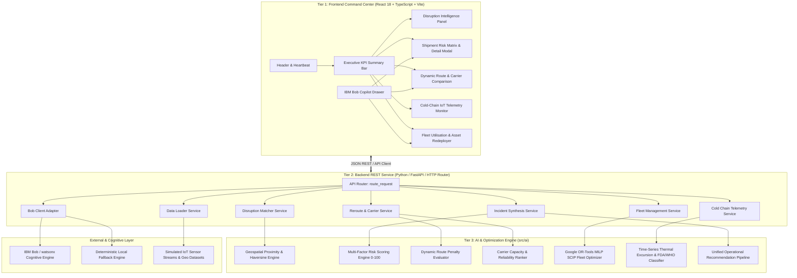

# Chain Guard AI — Architecture Document 🏗️

**Platform:** Chain Guard AI  
**Hackathon:** IBM Bob AI Innovation Hackathon 2026  

---

## 1. System Architecture Overview

Chain Guard AI is structured as a modular, decoupled, 3-tier enterprise architecture comprising a high-performance **React/TypeScript Frontend**, a robust **Python Backend & REST API Service**, and a specialized **AI & Mathematical Optimization Engine** integrated with the **IBM Bob Operations Copilot**.



---

## 2. Layer-by-Layer Breakdown

### Tier 1: Frontend Operations Control Center (`src/frontend/`)
- **Technology Stack:** React 18, TypeScript, Vite, TailwindCSS, Lucide Icons.
- **Design Paradigm:** Enterprise SaaS Logistics Control Tower.
- **Key Modules:**
  - `Header`: System health status, real-time UTC clock, scenario stepper.
  - `KpiBar`: Aggregated executive metrics with active disruption badges.
  - `DisruptionPanel`: Active hazards, impacted corridors, severity indicators.
  - `ShipmentRiskTable` & `ShipmentDetailModal`: Explainable risk factor breakdown with radar metrics.
  - `RouteComparison`: Side-by-side alternative route analysis, cost deltas, and delay savings.
  - `ColdChainMonitor`: High-resolution thermal time-series graphs with FDA/WHO regulatory tags.
  - `FleetOptimizer`: Asset status classification (`ACTIVE`, `IDLE`, `UNDERUTILIZED`, `UNAVAILABLE`) and redeployment dispatch actions.
  - `BobCopilotPanel`: Conversational operations drawer for contextual AI reasoning.

### Tier 2: Backend & Service Layer (`src/backend/`)
- **Technology Stack:** Python 3.12, Standard Library HTTP / FastAPI compatible router, Pydantic/Dataclasses.
- **Key Services:**
  - `data_loader.py`: Safe, isolated ingestion of shipments, disruptions, fleet assets, and telemetry.
  - `disruption_service.py`: Great-circle spatial evaluation across route waypoints.
  - `reroute_service.py`: Alternative route and carrier scoring.
  - `fleet_service.py`: Spatial proximity and cold-chain compatibility filtering.
  - `cold_chain_service.py`: Contiguous excursion clustering and FDA 21 CFR 211 / WHO GDP compliance auditing.
  - `incident_service.py`: Cross-functional incident dossier synthesis.
  - `bob/bob_client.py`: IBM Bob and watsonx cognitive adapter with deterministic fallback.

### Tier 3: AI & Optimization Engine (`src/ai/`)
- **Technology Stack:** Python 3.12, Google OR-Tools (Mixed-Integer Linear Programming via SCIP), Pydantic v2.
- **Key Modules:**
  - `disruption.py`: Spatial corridor matching and temporal overlap calculation.
  - `risk_scoring.py`: 5-factor weighted risk engine producing 0–100 scores with explainability.
  - `routing.py`: Multi-objective route trade-off scoring.
  - `carrier.py`: Carrier ranking by reliability, capacity, and temperature capabilities.
  - `optimization.py`: MILP optimization for minimum-cost, constraint-satisfying fleet redeployment.
  - `cold_chain.py`: Time-series sensor anomaly detection and regulatory severity classification.
  - `recommendations.py`: End-to-end unified decision pipeline.

---

## 3. Data Flow Diagram

```
Raw Sensor / Route Data
        ↓
[Data Loader Service]
        ↓
[Disruption Spatial Matcher] ──→ Disruption Impact
        ↓
[Multi-Factor Risk Engine] ────→ Risk Score (0-100) + Explainable Breakdown
        ↓
[Dynamic Route Evaluator] ─────→ Best Bypass Route (Distance, Delay, Cost)
        ↓
[Carrier Ranker] ──────────────→ Best Alternative Carrier (Reliability %, SLA)
        ↓
[OR-Tools MILP Solver] ────────→ Optimal Idle Fleet Reassignment
        ↓
[Cold-Chain Engine] ───────────→ FDA 21 CFR 211 / WHO GDP Classification
        ↓
[Incident Synthesizer] ────────→ Unified Executive Incident Dossier
        ↓
[IBM Bob Operations Copilot] ──→ Natural Language Decision Briefing + Directives
        ↓
[Frontend Control Tower] ──────→ Real-Time Visual Presentation & Dispatch Order
```

---

## 4. Security & Operational Reliability
- **Zero Committed Secrets:** All external API credentials handled strictly through environment variables (`BOB_API_KEY`, `WATSONX_API_KEY`).
- **Graceful Degradation:** Full operational functionality maintained offline through deterministic AI modules if cloud APIs are unreachable.
- **Type Safety:** 100% typed TypeScript interfaces in frontend mirrored by Pydantic schemas in backend.
